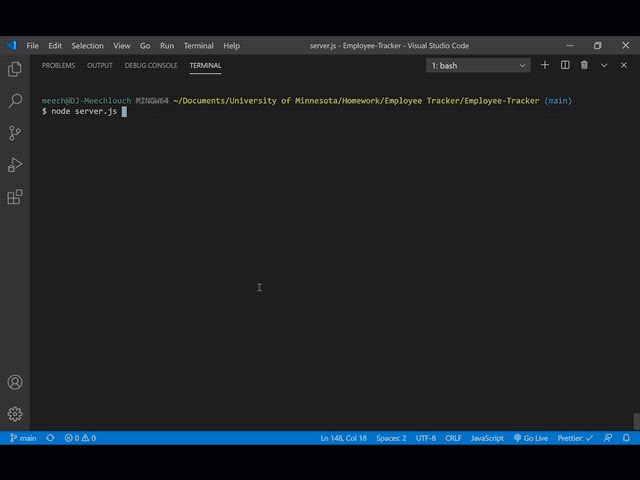

  <h1 align = "center">
  
   
  :star: Employee Management System :star:
  </h1>
  
  

# Table of Contents

- [Description](#description)
- [Installation](#installation)
- [Usage](#usage)
- [Contributing](#contributing)
- [Test](#test)
- [Credits](#credits)
- [License](#license)
- [Questions](#questions)

## :memo: Description

Employee Management System is a CLI application that allows a user to manage company records. Using mySQL, information
about the company is saved to a database and can be accessed using node.js. Inquirer than prompts the user while tables
are shown for the user to reference depending on the task trying to be accomplished. The EMP application has various
functionalities to allow a user to view, create, or update company records such as view/add/delete employees, company
roles and departments, update employee positions, managers, and manager's position and some other more powerful features
like looking up employees by the manager or looking up the total utilize budget of a particular department. The
application is formatted in such a way to make user readability viewable.

## :camera: Visuals

  
  
  :globe_with_meridians: Here is a video [description](https://meechlouch.github.io/Employee-Management-System/).

## Installation:

    Node.js, mySQL, Inquirer, console.table, and ASCII-art-logo.

## Usage:

    This application will be used via the command-line executed with the node index command. A table of the appropiate company records will display before and after Inquirer prompts, the first being a reference table and the later being a confirmation table.

## Contributing:

    None

## Test:

    Copy and Paste folders and files, npm i for dependancies, create mySQL database with schema.sql and populate with seed.sql, execute the node index command from the command-line.

## Credits:

    None

## :copyright: License:

This project is subject to 

MIT License

        Copyright (c) [2020] [Demetri Dillard]

        Permission is hereby granted, free of charge, to any person obtaining a copy
        of this software and associated documentation files (the "Software"), to deal
        in the Software without restriction, including without limitation the rights
        to use, copy, modify, merge, publish, distribute, sublicense, and/or sell
        copies of the Software, and to permit persons to whom the Software is
        furnished to do so, subject to the following conditions:

        The above copyright notice and this permission notice shall be included in all
        copies or substantial portions of the Software.

        THE SOFTWARE IS PROVIDED "AS IS", WITHOUT WARRANTY OF ANY KIND, EXPRESS OR
        IMPLIED, INCLUDING BUT NOT LIMITED TO THE WARRANTIES OF MERCHANTABILITY,
        FITNESS FOR A PARTICULAR PURPOSE AND NONINFRINGEMENT. IN NO EVENT SHALL THE
        AUTHORS OR COPYRIGHT HOLDERS BE LIABLE FOR ANY CLAIM, DAMAGES OR OTHER
        LIABILITY, WHETHER IN AN ACTION OF CONTRACT, TORT OR OTHERWISE, ARISING FROM,
        OUT OF OR IN CONNECTION WITH THE SOFTWARE OR THE USE OR OTHER DEALINGS IN THE
        SOFTWARE.

For more information on this [License](https://choosealicense.com/licenses/mit/)

## Questions:question:

:email: For additional questions, Get in touch at: Meechlouch@gmail.com

:octocat: Check out my [GitHub](https://github.com/Meechlouch)

:octocat: GitHub [Repository](https://github.com/Meechlouch/Employee-Management-System)
